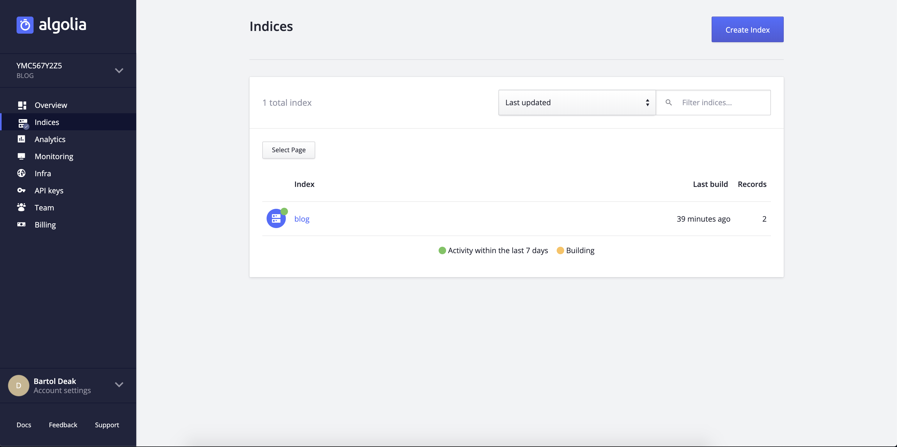
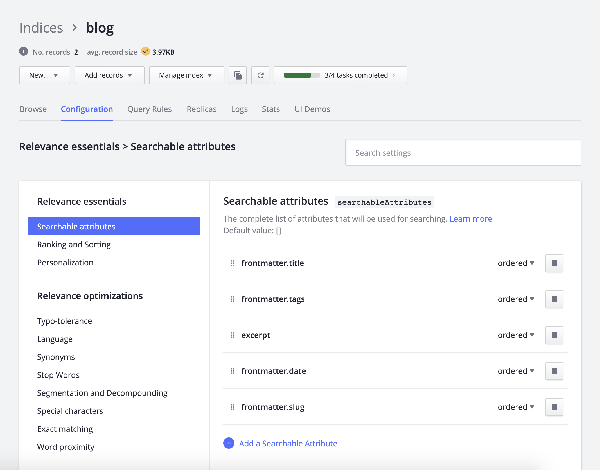
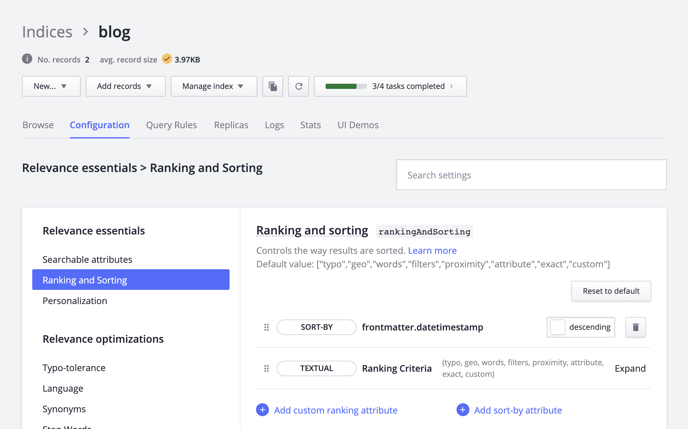

import Code from '../../src/components/code-prop'

As a first _real_ post in which you can learn something, I have chosen Algolia search because this is one of things for which I didn't really find complete tutorial, until I found [this one](https://www.youtube.com/watch?v=VSkXyuXzwlc). But still I would like to write this post just with a bit more clarification around little things that took me _too long_ to figure out myself.

### Prerequisites

- Just a working Gatsby site that has data you can query with GraphQL
- [Algolia account](https://www.algolia.com/users/sign_up)

### Goals

- Implement front-end and back-end for (hopefully working) search

### Basic terminology

- **Operation** - search query
- **Hits** - results from search query
- **Attribute** - searchable parameter (e.g. title)
- **Record** - one instance with all of the attributes
- **Indices** - databases in which all records are stored

## Setup

First things first, you should register for [Algolia account](https://www.algolia.com/users/sign_up) if you haven't it already.

When you get to your dashboard, navigate to 'Indices' and click big blue button called 'Create Index'. Give it a name and leave it for now.



After that is done, we are going back to terminal to install some dependencies for our project.

<Code path="Root of your project" lang="Bash" />

```bash
# for awesome people using yarn
yarn add gatsby-plugin-algolia algoliasearch react-instantsearch-dom dotenv

# or if npm is package manager of your choice
npm install gatsby-plugin-algolia algoliasearch react-instantsearch-dom dotenv
```

Now that we have successfully increased our already too big JavaScript bundle we can proceed to configure our [environment variables](https://en.wikipedia.org/wiki/Environment_variable). Oh, and it's time to go back to dashboard.

- Before playing with your environment variables and API keys please, make sure to add .env files to your [.gitignore](https://git-scm.com/docs/gitignore) and make sure no one is looking over your shoulder.

Okay, okay...can you tell me **_where to find those environment variables?_**

In tab called 'API keys' you can find your Application ID, Search-Only API Key and Admin API Key. Index name is name that you gave to your Index few minutes ago.


Copy them to file called .env.production in root of your project.

<Code path=".env.production" lang="Plain Text" />

```
ALGOLIA_APP_ID=insertValue
ALGOLIA_API_KEY=insertValue
ALGOLIA_SEARCH_KEY=insertValue
ALGOLIA_INDEX_NAME=insertValue
```

Enough of boring setup. Let's upload some records!

## Back-end

Now we are going to build 'back-end' of our search. Open your Gatsby config file and add [dotenv](https://github.com/motdotla/dotenv/blob/master/README.md) configuration to the top of file so environment variables work.

<Code path="gatsby-config.js" lang="JavaScript" />

```js
require('dotenv').config({
  path: `.env.${process.env.NODE_ENV}`
})
```

Next, you will create GraphQL query that will return all information you need to search. For [MDX](https://mdxjs.com/) blog that you are reading right now it looks like this but yours will most likely be very different.

<Code path="gatsby-config.js" lang="JavaScript" />

```js
const postQuery = `{
  posts: allMdx(
    filter: { frontmatter: { published: { eq: true } } }
  ) {
    edges {
      node {
          frontmatter {
            title
            slug
            date(formatString: "MMMM Do, YYYY")
            datetimestamp
            tags
            image {
              sharp: childImageSharp {
                fixed(width: 75, height: 75) {
                  src
                  srcSetWebp
                  aspectRatio
                  base64
                }
              }
              extension
              publicURL
            }
          }
          timeToRead
          excerpt(pruneLength: 100000)
      }
    }
  }
}`
```

This query is filtering so only posts declared as published are returned and everything that is returned here (title, slug, date, tags, post body...) is searchable. There is also image stuff for thumbnail and datetimestamp which is used for sorting (we will look into sorting hits later).

After that all that's left to do for back-end of search is to add gatsby-plugin-algolia to plugins array and pass some options to it.

<Code path="gatsby-config.js" lang="JavaScript" />

```js
module.exports = {
  ...
  plugins: [
    ...
    {
      resolve: 'gatsby-plugin-algolia',
      options: {
        appId: process.env.ALGOLIA_APP_ID,
        apiKey: process.env.ALGOLIA_API_KEY,
        indexName: process.env.ALGOLIA_INDEX_NAME,
        queries,
        chunkSize: 10000, // default: 1000
      },
    },
    ...
  ],
}
```

And that's it! If you configured everything correctly, after running your build command records will pop up in your Index.

## Front-end

If your back-end is working and you saw records in dashboard, hard part is done! If you weren't successful in previous part, I've shared links to some useful resources at the bottom.

I'll first show you basic pre-made search box and then we will look into building custom one.

<Code path="src/components/search.js" lang="JSX" />

```jsx
import algoliasearch from 'algoliasearch/lite'
import { InstantSearch, SearchBox, Hits } from 'react-instantsearch-dom'

const searchClient = algoliasearch('APP_ID', 'SEARCH_KEY')

export default () => (
  <InstantSearch searchClient={searchClient} indexName="INDEX_NAME">
    <SearchBox />
    <Hits />
  </InstantSearch>
)
```

- Note: You don't need to use dotenv in component file as APP_ID, SEARCH_KEY and INDEX_NAME can be public.

Now let's see how we can build custom search box.

<Code path="src/components/custom-search.js" lang="JSX" />

```jsx
import algoliasearch from 'algoliasearch/lite'
import { InstantSearch, Hits, connectSearchBox } from 'react-instantsearch-dom'
import PostPreview from './post-preview'

const searchClient = algoliasearch('APP_ID', 'SEARCH_KEY')

const Search = ({ currentRefinement, refine }) => (
  <form
    noValidate
    action=""
    role="search"
    onSubmit={event => event.preventDefault()}
  >
    <input
      type="search"
      value={currentRefinement}
      onChange={event => refine(event.currentTarget.value)}
      placeholder="Search"
      aria-label="Search"
    />
  </form>
)

const CustomSearchBox = connectSearchBox(Search)

export default () => (
  <InstantSearch searchClient={searchClient} indexName="INDEX_NAME">
    <CustomSearchBox />
    <Hits hitComponent={PostPreview} />
  </InstantSearch>
)
```

And now you can style or customize your search box. However we are still not done. You'll need to create component post-preview.js in your components folder.

When someone searches on your site Algolia will send hits in JSON and wrap them in component that you pass (in this case post-preview.js).

Here is how it looks like for my blog (simplified, without styles). [Full version](https://github.com/bartold3ak/bartol.dev/blob/master/src/components/post-preview.js).

<Code path="src/components/post-preview.js" lang="JSX" />

```jsx
import React from 'react'
import { Link } from 'gatsby'
import Image from 'gatsby-image'

const PostPreview = ({ hit }) => {
  // make gatsby-image not freak out when you pass svg images for thumbnail
  let img
  if (!hit.frontmatter.image || hit.frontmatter.image.extension === 'svg') {
    img = (
      
    )
  } else {
    img = (
      <Image
        fixed={hit.frontmatter.image.sharp.fixed}
        alt={hit.frontmatter.title}
      />
    )
  }

  return (
    <>
      <article>
        <Link to={hit.frontmatter.slug}>{img}</Link>
        <div>
          <h2>
            <Link to={hit.frontmatter.slug}>{hit.frontmatter.title}</Link>
          </h2>
          <p>
            {hit.frontmatter.date} {hit.timeToRead}
          </p>
        </div>
      </article>
    </>
  )
}

export default PostPreview
```

## Configuration

### Searchable attributes

List of attributes that will be used for searching. Navigate to your Index, click on tab 'Configuration' and in navigation bar select 'Searchable attributes'. Add all your Searchable attributes and rank them based on importance.



### Sorting

For sorting to work you will need to create datetimestamp in your frontmatter. Date timestamp must be in [unix time](https://en.wikipedia.org/wiki/Unix_time) format. Here is link to [online date to unix timestamp converter](https://www.unixtimestamp.com/), or if you are using Alfred you can install [this](http://www.packal.org/workflow/timestamp) awesome workflow.



### Display number of hits (optional)

Show number of search results next to search box.
For this to work, you will only need to add 4 more lines to your search component.

<Code path="src/components/custom-search.js" lang="JSX" />

```jsx
import algoliasearch from 'algoliasearch/lite'
import {
  InstantSearch,
  Hits,
  connectSearchBox,
  connectStats // highlight-line
} from 'react-instantsearch-dom'
import PostPreview from './post-preview'

const searchClient = algoliasearch('APP_ID', 'SEARCH_KEY')

const Search = ({ currentRefinement, refine }) => (
  <form
    noValidate
    action=""
    role="search"
    onSubmit={event => event.preventDefault()}
  >
    <input
      type="search"
      value={currentRefinement}
      onChange={event => refine(event.currentTarget.value)}
      placeholder="Search"
      aria-label="Search"
    />
  </form>
)

const CustomSearchBox = connectSearchBox(Search)

const Stats = ({ nbHits }) => <div>{nbHits}</div> // highlight-line

const CustomStats = connectStats(Stats) // highlight-line

export default () => (
  <InstantSearch searchClient={searchClient} indexName="INDEX_NAME">
    <CustomStats /> {/* highlight-line */}
    <CustomSearchBox />
    <Hits hitComponent={PostPreview} />
  </InstantSearch>
)
```

### Conclusion

I hope that progress of building search was fun and easy also that you are proud of what you made. You should be! It's all about small steps.

### Resources

- [Add Algolia search to your Gatsby site - Jason Lengstorf](https://www.youtube.com/watch?v=VSkXyuXzwlc)
- [Adding search with Algolia - Gatsby docs](https://www.gatsbyjs.org/docs/adding-search-with-algolia/)
- [Building Search UI - Algolia docs](https://www.algolia.com/doc/guides/building-search-ui/getting-started/react/)
- [Online date to unix timestamp converter](https://www.unixtimestamp.com/)
- [Timestamp Alfred workflow](http://www.packal.org/workflow/timestamp)
